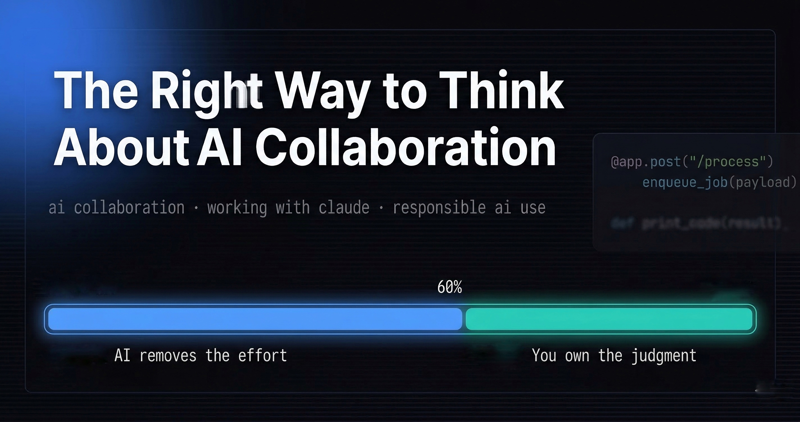

I copied a PySpark transformation out of Claude's response straight into a pipeline last month  .

It worked. Tests passed. The job ran.

I noticed it while analyzing performance — tasks were taking longer than expected. The transformation used a wide operation where a narrow one was enough. More shuffle, slower execution, higher cost. Nothing broke. It just ran worse than it should have.

The mistake wasn't the code. It was skipping the review because it *looked* right. Once output compiles and reads clean, the temptation to move on is real. That's the actual risk.



## AI removes effort, not thinking

Tasks that used to take hours now take minutes. Debugging a DAG, writing a transformation, drafting runbook docs. But only if you already know what good looks like.

AI is excellent at the first draft. The generic case. What it doesn't know is your specific pipeline, your data distribution, your cost constraints, or why your team made a particular architectural call two years ago.

I'd say AI handles about 60% of the effort on most technical tasks. The remaining 40% — judgment, trade-offs, production-readiness — is still on you. And that 40% has gotten harder, not easier, because the code around it looks confident. AI-generated code doesn't come with hedges or "TODO: revisit this." It just looks done. That's the part nobody tells you about.

<div class="callout callout-info">AI compresses the first 60% of effort — research, boilerplate, first drafts. The remaining 40% is judgment: does this fit your system, your constraints, your production reality? That part doesn't shrink.</div>

---

## What good AI collaboration actually looks like

I use Claude most days. Pipeline design, SQL debugging, first drafts of docs. The difference between useful and useless usually comes down to how much context I give upfront.

"Write a PySpark job" gets you a generic job. "Write a PySpark job that processes 500M rows daily with moderate skew on the partition key, running on Dataproc, memory-constrained" gets you something usable. Specific constraints produce specific output. Vague prompts get you Stack Overflow in disguise.

The PySpark incident changed how I review things. I used to check syntax. Now I check intent: does this do what *my system* needs, not just what the prompt describes? Those are different questions.

One other thing that's helped: using Claude to map problems rather than just solve them. "What are the tradeoffs between broadcast joins and sort-merge joins at this scale?" is more useful than "write me this join." You want the map, not just one route.

---

## What I don't share with Claude at work

If something is tied to a real user, a client, or a live business decision, it doesn't go in as-is. Raw production data, client identifiers, internal architecture tied to compliance — none of it.

Not because Claude is untrustworthy. Because AI tools aren't the right place to paste raw context without thinking. Every prompt is a potential data surface.

What I do instead: abstract before pasting. Replace real values with mock data. Describe the schema instead of sharing actual records. Turn it into a type-of-problem question rather than a here-is-my-actual-system question.

Cleaning a prompt takes a few minutes. And it has a side effect — it usually forces you to understand what you're actually asking. If you can describe the problem without the specific data, you probably understand it better than you did when you started.

<div class="callout callout-warning">Never paste raw production data, client identifiers, or internal system details into an AI tool. Abstract first — replace real values with mock data, describe schemas instead of sharing records. Every prompt is a potential data surface.</div>

---

## Where it breaks

I was building a FastAPI service to accept incoming requests and trigger downstream data pipelines.

Claude's suggestion looked clean:

```python
@app.post("/process")
def process_data(payload: RequestModel):
    result = run_heavy_job(payload)  # long-running task
    return {"status": "done", "result": result}
```

Define the endpoint, parse the payload, call the processing function. It worked locally. No obvious issues.

Then we put it under real traffic.

Requests started timing out. API latency spiked. The system couldn't scale. The problem wasn't a bug — the API was doing heavy processing synchronously inside the request-response cycle. Every request held a connection open until the job finished.

What I changed was the architecture, not the code:

```python
@app.post("/process")
def process_data(payload: RequestModel):
    job_id = enqueue_job(payload)  # push to postgres and run the job in background
    return {"status": "accepted", "job_id": job_id}
```

Accept the request, push to a queue, return immediately. The actual processing happens async, separate from the API layer. Latency dropped, timeouts went away, and now the two concerns scale independently.

AI gave me something that was syntactically correct, ran fine in dev, and would have caused real problems in production. It optimized for "does this work?" I needed "will this survive traffic?"


<div class="callout callout-danger">AI-generated code optimises for correctness, not production-readiness. It won't flag that your endpoint will time out under real traffic, or that two concerns shouldn't share a process boundary. That review is on you.</div>

That's the gap. AI solves for correctness. Production-readiness is still your problem.

---

## Before you ship the next AI-generated solution

Write one sentence: why is this approach right for your specific system, not just for the problem as described?

If you can't write it, keep reviewing.

That's the work. It doesn't go away just because the code looks clean.
