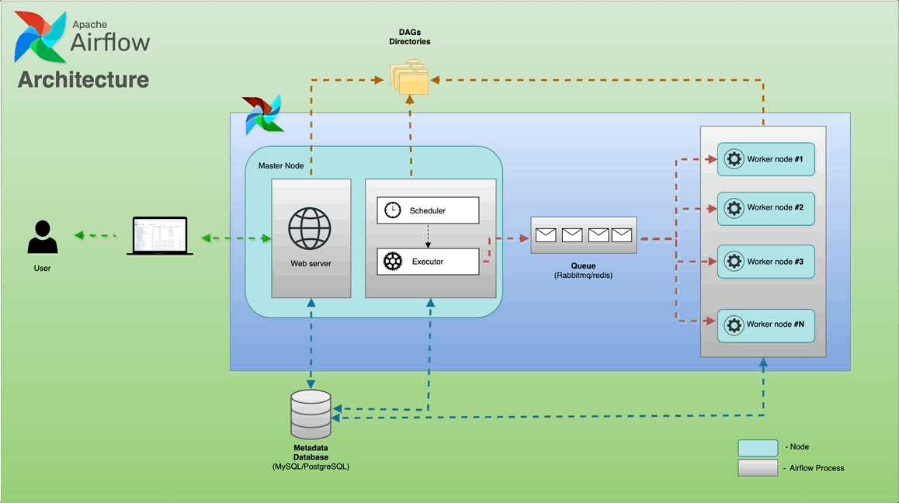
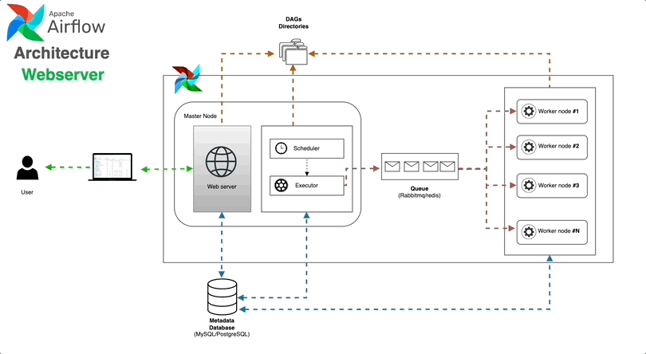
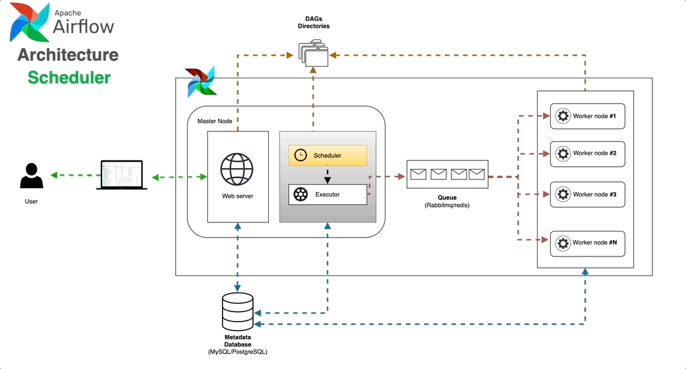
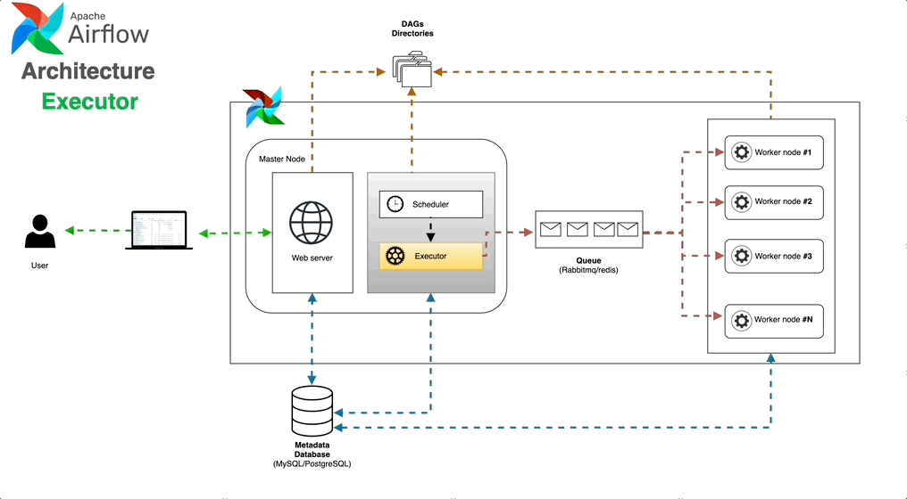
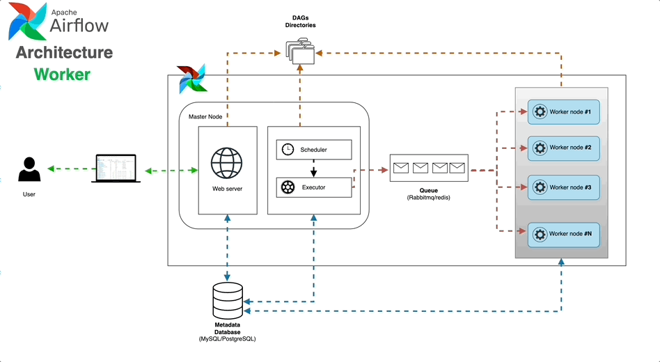
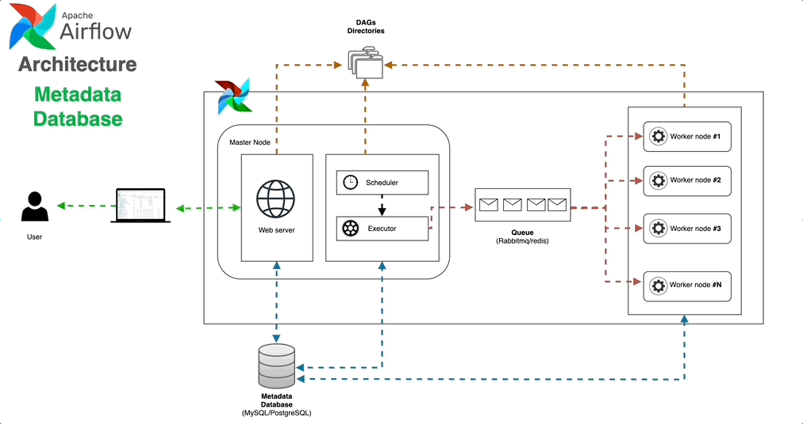
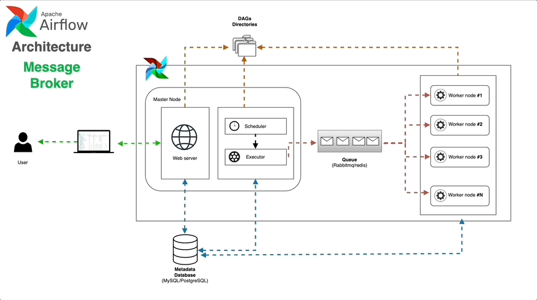

> Originally published on [Medium – Apache Airflow publication](https://medium.com/apache-airflow/airflow-architecture-simplified-3d582fc3ccb0).

[Apache Airflow](https://airflow.apache.org/) is an open-source platform designed to orchestrate complex data workflows. It uses **Directed Acyclic Graphs (DAGs)** to define a series of tasks and their dependencies. Airflow is made up of several microservices that collaborate to execute these tasks.

Before getting into the components, it helps to know what problem Airflow is actually solving. Data pipelines get messy fast — cron jobs that fail silently, scripts with no retry logic, no record of what ran or when. Airflow trades that for a code-first approach: define your workflow in Python, and it handles the scheduling, retries, and logging. The whole architecture follows one rule: the thing that defines work, the thing that schedules it, and the thing that runs it are kept separate.

Here's a breakdown of the key components.

## Components

### Web Server 🌐

The Airflow UI where you can monitor and manage DAGs, Variables, Connections, and check logs. It provides a dashboard that helps you visualise your data workflows, check their progress, and troubleshoot any issues.

Under the hood it's a Flask app served by Gunicorn. One thing worth knowing: the Web Server talks to the Metadata Database, not the Scheduler. So the UI isn't showing live state — it's showing what the database last recorded.

From the Web Server you can:
- Trigger DAG runs manually, or pause/unpause a DAG
- Read task logs from any run
- Manage Connections and Variables — credentials and config your tasks pull at runtime
- Switch between Grid, Graph, and Gantt views to understand flow and timing
- Browse XCom values — small bits of data tasks pass between each other

The Web Server holds no state of its own. You can run multiple instances behind a load balancer if you need redundancy.

### Scheduler 🕰️

Responsible for managing the execution of tasks. It monitors the DAGs and schedules tasks based on their dependencies and timing configurations, making sure that tasks are executed in the right order and at the right time.

The Scheduler runs a loop that does four things: parses DAG files, creates DagRun records when a schedule fires, checks task dependencies, and queues tasks that are ready.

1. Parses DAG files from the `dags/` folder at a configurable interval
2. Creates DagRun records in the Metadata DB when a DAG's schedule is due
3. Evaluates task dependencies and marks tasks as ready
4. Submits those tasks to the Executor

In Airflow 2.x the Scheduler was rewritten to support multiple instances running in parallel (HA mode) using database-level locking — removing the old single-point-of-failure problem.

The Scheduler doesn't run your code. It decides what runs and when, then passes that off to the Executor.

### Executor ⚙️

The Executor's primary role involves executing tasks. It interacts with the Scheduler to obtain task details and initiates the required processes or containers for task execution.

Picking an executor is probably the biggest infrastructure decision in an Airflow deployment. The options:

- **SequentialExecutor** — one task at a time, same process as the Scheduler. Fine for local debugging, not for production.
- **LocalExecutor** — tasks run as subprocesses on the same machine. No broker, no separate workers. Works fine for smaller teams on a single VM.
- **CeleryExecutor** — the standard choice for distributed setups. Tasks go onto a queue (Redis or RabbitMQ), Celery workers pick them up. Add more workers to scale. You'll also need to manage the broker and optionally Flower for monitoring.
- **KubernetesExecutor** — spins up a fresh pod per task, tears it down when done. Good isolation, no idle costs, and each task can specify its own image and resource limits. The catch is pod startup latency, which is noticeable for short-running tasks.
- **CeleryKubernetesExecutor** (hybrid) — routes tasks to either Celery workers or Kubernetes pods on a per-task basis. Useful when most tasks want warm workers but a few need isolated environments or custom images.

### Worker 👷

The Worker is a component that performs the tasks assigned by the Executor. Depending on the chosen Executor, it can be a separate process, a Celery worker process, or a Kubernetes pod.

Workers run the actual task code and report results back to the Executor. Logs get written to whatever backend you've configured (local disk, S3, GCS) and the Web Server retrieves them from there.

With CeleryExecutor, workers are long-running processes sitting on the queue. The `worker_concurrency` setting controls how many tasks one worker handles at once.

With KubernetesExecutor, each worker is a pod that exists only for one task. Airflow gets the DAG files in via a shared volume, a git-sync sidecar, or by baking them into the image.

Set up a remote log backend (S3, GCS, or Azure Blob) before you deploy workers on separate machines. Airflow defaults to local disk, which silently breaks log retrieval in distributed setups. This is much easier to configure upfront than to fix after the fact.

### Triggerer 🔔

The Triggerer was added in Airflow 2.2 and most diagrams still skip it — which is a shame, because it solves a real problem.

Before it existed, a task waiting on something external (an S3 file showing up, a Spark job finishing, an API responding) held a worker slot the whole time it waited, even if it was just polling once a minute. On a big pipeline that adds up. Worker slots fill with tasks that aren't doing any real work.

Deferrable operators change this. When a task hits a waiting state, it hands itself off to the Triggerer and frees its worker slot. The Triggerer runs all deferred tasks in a single async event loop via `asyncio`. When a condition is met, it wakes the task and the Scheduler puts it back in the queue.

One Triggerer can handle hundreds of sleeping tasks without trouble.

If you're running <code>HttpSensor</code>, <code>S3KeySensor</code>, or cloud-native sensors at any real volume, switch to their deferrable versions. It frees up worker slots that would otherwise sit idle waiting for external conditions.

### Metadata Database 🛢

This is where Airflow keeps track of all your workflows, including details about the tasks you've set up and how they've run in the past. It's like a central hub for storing and organising everything related to your scheduled tasks — helping you keep an eye on progress and troubleshoot any issues that come up.

Airflow works with PostgreSQL, MySQL, and SQLite.

SQLite only works with SequentialExecutor and is strictly for local testing. If you're deploying for anything real — even a small team — use PostgreSQL. Retrofitting the database backend later is painful.

PostgreSQL is the right pick for anything real. It handles Airflow's write-heavy workload well and works with every major managed database service (AWS RDS, Cloud SQL, Azure Database).

What the Metadata DB stores:

- DAG definitions — parsed metadata, not the Python source itself
- DagRun records — every run, its state, and timing
- TaskInstance records — state, retry count, duration, and timestamps for each task execution
- XCom values — data passed between tasks
- Variables and Connections — runtime config and credentials
- User and role data for RBAC

The database is a single point of failure in most setups. Run it as a managed, replicated service — and not on the same machine as the Scheduler.

### Message Broker ✉️ (Optional)

In setups where the `CeleryExecutor` is used for distributing tasks, a message broker plays a crucial role. Brokers like **RabbitMQ** or **Redis** act as a middleman between the Scheduler and the Workers — passing task details from the Scheduler to the Workers, ensuring tasks are executed reliably and efficiently across the distributed system.

Redis is the more common pick — easier to operate and good enough for Airflow's access patterns. RabbitMQ gives stronger message durability guarantees but brings more operational overhead.

The broker only matters if you're using CeleryExecutor. LocalExecutor and KubernetesExecutor don't need one.

## How the components interact

To see how it all fits together, follow a task from file to completion:

1. You write a DAG and drop it in the `dags/` folder (or a remote repo)
2. The Scheduler parses it and writes the DAG record to the Metadata DB
3. When a run is due, the Scheduler creates a DagRun and checks which tasks are ready
4. Ready tasks go to the Executor — with CeleryExecutor, onto the message queue
5. A worker picks up the task, runs the code, and writes logs
6. The worker updates the TaskInstance state in the DB (success, failed, retry)
7. The Scheduler sees the update, evaluates downstream tasks, and the loop continues
8. The Web Server reads the DB and shows current state whenever you open the UI

## Deployment patterns

- **Single-node** — Scheduler, Web Server, and LocalExecutor on one machine with PostgreSQL. Easy to set up, limited ceiling.
- **Distributed with Celery** — Scheduler and Web Server on one or more nodes, workers on separate machines, Redis or RabbitMQ as the broker. Most common in production.
- **Kubernetes-native** — everything runs as pods, KubernetesExecutor handles task isolation. Deploy with the [official Helm chart](https://airflow.apache.org/docs/helm-chart/stable/index.html).
- **Managed** — AWS MWAA, Google Cloud Composer, or Astronomer take care of the infrastructure. Makes sense when your team's time is better spent on pipelines than on ops.

---

If you like the diagrams, all designs (GIFs, images, and draw.io templates) are available in my GitHub repository:

**Repo:** [https://github.com/raviteja-git/Airflow/tree/main/Airflow%20Architecture](https://github.com/raviteja10096/Airflow/tree/main/Airflow_Architecture)

Feel free to reach out on [LinkedIn](https://www.linkedin.com/in/traviteja/) if you have any questions or want to learn more about Airflow!
