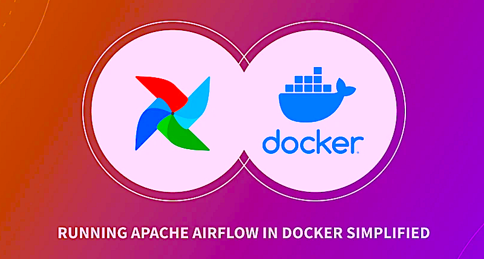
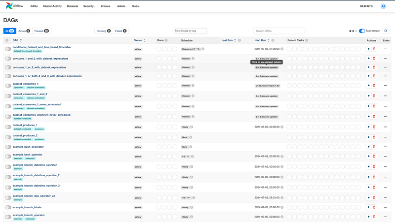
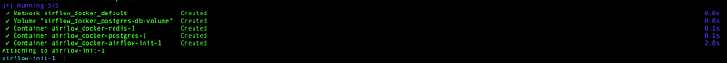
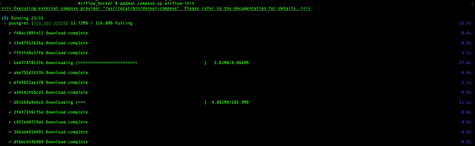
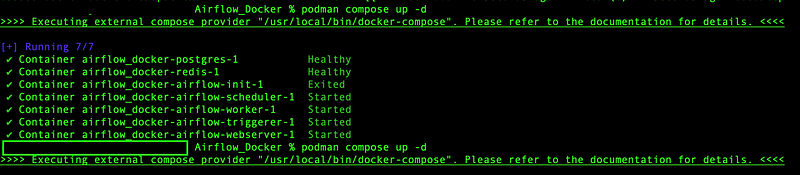

> Originally published on [Medium – Apache Airflow publication](https://medium.com/apache-airflow/airflow-installation-simplified-using-docker-compose-podman-compose-d840a24248ba).



**Contents**
- Introduction
- Installing Apache Airflow
- Running Docker Compose
- Interacting with Airflow UI
- Clean up

GitHub Link — [https://github.com/raviteja10096/Airflow/tree/main/Airflow_using_Docker](https://github.com/raviteja10096/Airflow/tree/main/Airflow_using_Docker)

## Introduction

Airflow is a popular tool that simplifies complex workflows. It allows you to programmatically define, schedule, and monitor your workflows, all in one place. While Airflow is a powerful option, installation can sometimes feel overwhelming.

This guide will break down the setup process into two easy-to-follow methods, getting you up and running with Airflow in no time.

**Sample Airflow UI:**



## Installing Airflow

### Airflow Components

We have different services like scheduler, webserver, worker, redis, postgres, flower and postgres which help you to run Airflow.

The [docker-compose.yaml](https://github.com/raviteja10096/Airflow/blob/main/Airflow_Docker/docker-compose.yml) file includes the following service definitions:

**airflow-scheduler** — Manages and schedules tasks and DAGs.

```yaml
airflow-scheduler:
  <<: *airflow-common
  command: scheduler
  healthcheck:
    test: ["CMD", "curl", "--fail", "http://localhost:8974/health"]
    interval: 30s
    timeout: 10s
    retries: 5
    start_period: 30s
  restart: always
  depends_on:
    <<: *airflow-common-depends-on
    airflow-init:
      condition: service_completed_successfully
```

**airflow-webserver** — Hosts the web interface accessible at [localhost:8080](http://localhost:8080/).

```yaml
airflow-webserver:
  <<: *airflow-common
  command: webserver
  ports:
    - "8080:8080"
  healthcheck:
    test: ["CMD", "curl", "--fail", "http://localhost:8080/health"]
    interval: 30s
    timeout: 10s
    retries: 5
    start_period: 30s
  restart: always
  depends_on:
    <<: *airflow-common-depends-on
    airflow-init:
      condition: service_completed_successfully
```

**airflow-worker** — Executes tasks assigned by the scheduler.

```yaml
airflow-worker:
  <<: *airflow-common
  command: celery worker
  healthcheck:
    test:
      - "CMD-SHELL"
      - 'celery --app airflow.providers.celery.executors.celery_executor.app inspect ping -d "celery@${HOSTNAME}"'
    interval: 30s
    timeout: 10s
    retries: 5
    start_period: 30s
  restart: always
```

**airflow-init** — Initializes the Airflow setup.

**flower** — Monitors and provides insights into the environment. Available at [localhost:5555](http://localhost:5555/). (Optional)

```yaml
flower:
  <<: *airflow-common
  command: celery flower
  profiles:
    - flower
  ports:
    - "5555:5555"
  healthcheck:
    test: ["CMD", "curl", "--fail", "http://localhost:5555/"]
    interval: 30s
    timeout: 10s
    retries: 5
    start_period: 30s
  restart: always
```

**postgres** — Serves as the metadata database.

```yaml
postgres:
  image: postgres:13
  environment:
    POSTGRES_USER: airflow
    POSTGRES_PASSWORD: airflow
    POSTGRES_DB: airflow
  volumes:
    - postgres-db-volume:/var/lib/postgresql/data
  healthcheck:
    test: ["CMD", "pg_isready", "-U", "airflow"]
    interval: 10s
    retries: 5
    start_period: 5s
  restart: always
```

**redis** — Facilitates message forwarding from the scheduler to the workers. (Optional)

```yaml
redis:
  image: redis:7.2-bookworm
  expose:
    - 6379
  healthcheck:
    test: ["CMD", "redis-cli", "ping"]
    interval: 10s
    timeout: 30s
    retries: 50
    start_period: 30s
  restart: always
```

### Airflow Volumes

Besides the common environment variables, we have four volumes: `dags`, `logs`, `config` and `plugins`. Create these 4 folders in your local machine:

- **dags** — For placing DAG scripts
- **logs** — For Airflow logs
- **config** — For Airflow configurations
- **plugins** — For extra plugins



### Permissions

For seamless volume synchronization, we need to confirm that the UID and GID permissions on the Docker volumes align with those on the local filesystem.

In the YAML file this line provides permissions:

```yaml
user: "${AIRFLOW_UID:-50000}:0"
```

Run these commands in your local environment:

<div class="callout callout-tip">
Run these before <code>docker compose up</code> — skipping this step is the most common reason volume mounts fail on Linux. On macOS, UID mismatch errors are less common but it's still worth doing.
</div>

```bash
echo -e "AIRFLOW_UID=$(id -u)" > .env
echo -e "AIRFLOW_GID=0" >> .env
```

Your `.env` file will look like:

```
AIRFLOW_UID=501
AIRFLOW_GID=0
```

Full Docker Compose file — [Link](https://github.com/raviteja10096/Airflow/blob/main/Airflow_using_Docker/docker-compose.yml)

## Run Docker Compose

Once all the setup is done, run the init command. I'm using Podman — feel free to use Docker or Podman interchangeably.

```bash
# Docker
docker-compose up airflow-init

# Podman
podman compose up airflow-init
```



Then start all services in detached mode:

```bash
# Docker
docker compose up -d

# Podman
podman compose up -d
```



## Accessing the Web Interface

Once all containers are up and running, open [localhost:8080](http://localhost:8080/) in your browser and login with:

- **Username:** `airflow`
- **Password:** `airflow`

<div class="callout callout-warning">
These are the default demo credentials. Fine for local development, but change them before exposing Airflow outside localhost — the <code>AIRFLOW__WEBSERVER__SECRET_KEY</code> and admin password should both be set before any real deployment.
</div>

After logging in you can see your DAGs listed in the UI.

We've successfully installed the full version of Airflow in just a few minutes using Docker! 🎉

## Clean Up

```bash
# Docker
docker compose down

# Podman
podman compose down
```

## References

- Airflow Documentation — [https://airflow.apache.org/docs/](https://airflow.apache.org/docs/)
- Git Repo — [Link](https://github.com/raviteja10096/Airflow/blob/main/Airflow_using_Docker/README.md)
