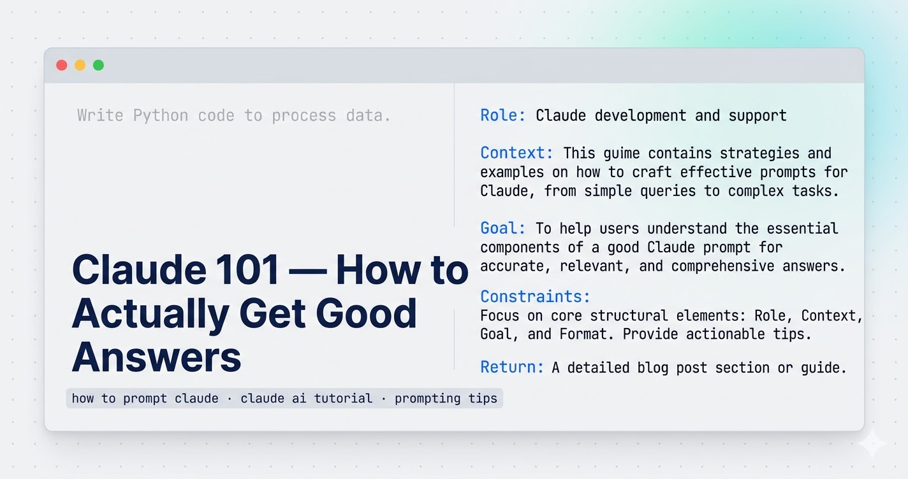

A colleague asked me to review what she'd typed into Claude: *"Write Python code to process data."*

Claude gave her something. A loop, some placeholder column names, a print statement at the end. Technically Python. Completely useless for what she was actually trying to do.

She was convinced Claude wasn't that good. I was convinced she'd never learned how to prompt Claude properly. Those are very different problems.

This article covers the one skill that changes how useful Claude is — not theory, just the pattern that actually works, with real before/after examples.

## Why most Claude prompts fail

The model isn't psychic. When you give it a vague instruction, it fills the gaps with the most average interpretation of what you might mean. "Write Python code to process data" is genuinely ambiguous — it could mean a ten-line pandas script or a distributed PySpark job. Claude picks one. It's rarely the right one.

Being polite doesn't fix this. Typing more words doesn't either. What fixes it is giving Claude the same context you'd give a capable colleague who just joined your project mid-sprint.

## The structure that actually works

Every prompt that gets me a useful first response has four things: a role, the context, the actual goal, and what I want back.

Four pieces. That's the whole thing.

Here's what it looks like in practice.

### Bad prompt

```
Write Python code to process data.
```

That's what my colleague typed. Claude returned generic pandas code that didn't match her data structure, ignored her scale requirements, and would have fallen over on anything above a few hundred thousand rows.

### Prompt that works

```
You are a senior Python data engineer.

I have multiple CSV files (~2 million records total) stored in a folder.
Each file contains columns: user_id, event_type, timestamp.

Goal:
- Combine all files
- Remove duplicates based on (user_id, timestamp)
- Count events per user
- Output result as a Parquet file

Constraints:
- Use PySpark (not pandas)
- Optimize for performance (cluster execution)
- Include comments explaining transformations

Return:
- Complete PySpark code
- Brief explanation of optimization choices
```

Same task. Completely different output. The first prompt got something that looked like code. The second got working production-grade code with partitioning comments, a proper deduplication strategy, and an explanation of the choices it made.

The difference is specificity. You told Claude who it is, what the actual situation is, what you need done, and exactly what to give you back.

<div class="callout callout-tip">
The four-part pattern: <strong>Role → Context → Goal → Return format.</strong> That's the whole thing. If a prompt is failing, one of these four pieces is missing or too vague.
</div>

## How to prompt Claude: the four-part pattern


### 1. Set the role

Start with "You are a [specific expert]." Not vague — specific.

- "You are a senior Python data engineer" works better than "You are a programmer"
- "You are a technical writer who specializes in API documentation" works better than "You are a writer"

This isn't magic. It shifts the model toward the vocabulary, reasoning patterns, and assumptions that expert actually uses. The gap in output quality between a vague role and a specific one is real and immediate.

### 2. Give it your actual context

What are you working with? What does the data look like? What's the environment? What's already been tried?

The more specific you are, the less Claude has to guess. And every guess it makes is a chance for the answer to drift from what you actually need.

For the script above, the context was: 2 million records, CSVs in a folder, specific column names, performance matters. That's not many words. But each piece eliminates a class of wrong answers.

### 3. State the goal clearly

Not "help me with my data pipeline." Tell it exactly what the output should do. List the steps if there are multiple. Be specific about constraints — technology stack, performance requirements, what's off the table.

Constraints do a lot of work. "Don't use pandas" saved me from a response that would have been technically correct but useless at scale.

### 4. Say what you want back

"Return: complete PySpark code + brief explanation of optimization choices." That one line changes the format of the response. Without it, Claude decides what to include. Sometimes that's fine. For technical work, specify what you actually need.

## When Claude gives you a mediocre answer, push back

This is where most people give up. They get a so-so answer, assume that's the ceiling, and close the tab.

It isn't.

When I got a first draft of the PySpark code that was too conservative — using operations that would hammer the driver on large datasets — I didn't ask it to "improve" things. I told it exactly what was wrong:

```
This is too generic.

- My dataset is large (2M+ records), so avoid collect() or driver-heavy operations.
- Use efficient transformations and explain partitioning strategy.
- Also include how to handle schema inference issues and corrupt records.

Please refine the solution with production-grade practices.
```

Three specific problems, one clear ask. The next response addressed all three.

"Improve this" doesn't work because it's still vague. Claude needs to know what improvement means in your specific situation — faster, more readable, more defensive, more production-ready. Pick the one that matters and say it directly.

## How to use file uploads well

When you upload a PDF, a script, or a CSV, Claude can only work with what you point it toward. Drop a 3,000-line file with no guidance and you'll get a surface-level summary that misses everything you actually care about.

The thing that matters most: say what you want done, specifically. "Find bugs", "optimize performance", "refactor the error handling" — not "take a look at this." Claude needs a lens.

For a slow script, I'll add something like: *"Focus on this function — it's where the bottleneck is."* That focuses the response. Without it, you get a full-file overview that buries the thing you actually needed to know.

For large files, I'll ask for structure before depth: *"Summarize what this file does section by section, then we'll optimize step by step."* Trying to get everything in one pass usually gets you something shallow. Two passes works better.

For error logs, don't just paste the stack trace. Include the exact error, what you expected to happen, and what actually happened. Claude can work from a stack trace alone, but knowing your expectation helps it skip the wrong diagnoses.

Here's a prompt format that works well for performance work:

```
You're a Python performance expert.

I have a script processing 2M records using pandas, and it's slow (~10 minutes).

Tasks:
1. Identify bottlenecks
2. Suggest optimizations (vectorization, multiprocessing, or PySpark if needed)
3. Rewrite the slow parts

Return:
- Optimized code
- Before vs after explanation
```

Role, situation, numbered tasks, explicit return format. That structure gets a useful answer on the first try, most of the time.

## Where this breaks down

The four-part pattern isn't a magic prompt formula. It breaks in a few specific places, and it's worth knowing which ones.

Open-ended creative work is one of them. If you don't have a clear goal, giving Claude a detailed spec produces mediocre output that exactly matches your mediocre spec. Sometimes you need to be vague on purpose, iterate, and let the direction emerge. Over-specifying early kills that process.

The other failure mode is when Claude doesn't know it's wrong. If you give it confident but incorrect context — wrong assumptions about your data, a misremembered API signature, an outdated library version — it produces confident output that fits your wrong premise. The pattern doesn't protect you from your own mistakes. Always sanity-check technical output before you run it.

And in long sessions on complex problems, the model can drift. It starts solving what it thinks you need rather than what you actually need. When that happens, starting fresh with a clean prompt works better than trying to correct the existing thread. I've wasted more time trying to nudge a drifted conversation back on track than I've ever saved by staying in the same session.

<div class="callout callout-warning">
If Claude starts giving answers that feel off-topic or contradict earlier decisions in the session, don't keep pushing. Start a new chat with a clean summary of where you are. Staying in a drifted conversation costs more time than restarting it.
</div>

## The actual takeaway

Most people who tell me Claude isn't useful have never written a prompt with a role, context, goal, and return format. They've typed a vague question, gotten a vague answer, and concluded that's the tool's ceiling.

It isn't.

Take the next thing you'd normally ask Claude and rewrite it with those four pieces. You don't need a rigid template — just make sure each piece is there. The difference in the first response is usually obvious.

For how I use Claude across an entire project — not just individual prompts — [What is Claude AI?](/blog/what-is-claude-ai/) covers the broader picture, including where it's earned a permanent spot in my workflow and where I still don't fully trust it.
