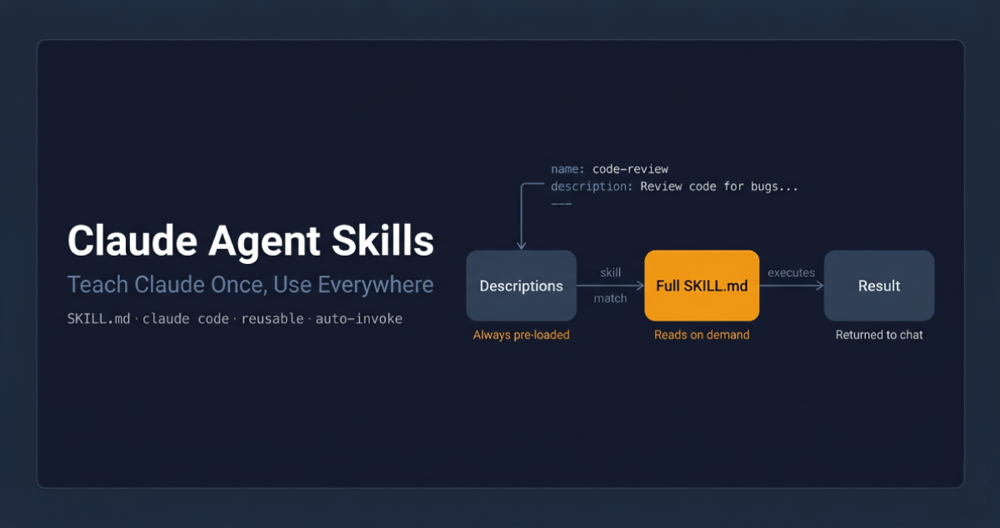

I'd typed the same instructions to Claude maybe twenty times over two months.

Every PR review session, the same block of text: check for our error handling pattern, flag any raw SQL concatenation, look for missing null guards on external inputs. Not complicated. Just specific to how my team works. And every new session, I started from scratch because Claude remembered nothing.

I knew this was stupid. I kept doing it anyway.

Then I discovered skills. I wrote those instructions once, saved them as a `SKILL.md` file, and haven't typed them since. Claude picks them up automatically at the start of every review — same checklist, same format, every time.

That was three weeks ago. Here's everything I wish I'd known before then.



---

## What a skill actually is

A skill is a folder with a single file inside: `SKILL.md`. That file has two parts — a small YAML header with a `name` and `description`, and below that, the actual instructions Claude follows.

Here's the PR description skill from Anthropic's own course on skills:

```
---
name: pr-description
description: Writes pull request descriptions. Use when creating a PR, writing a PR, or when the user asks to summarize changes for a pull request.
---

When writing a PR description:

1. Run `git diff main...HEAD` to see all changes on this branch
2. Write a description following this format:

## What
One sentence explaining what this PR does.

## Why
Brief context on why this change is needed.

## Changes
- Bullet points of specific changes made
- Group related changes together
- Mention any files deleted or renamed
```

The `description` field is the important one. That's how Claude decides whether to use the skill at all — it compares what you're asking against that description and looks for a match. Write it as a clear statement of when the skill applies, not what it does. "Writes pull request descriptions. Use when creating a PR" is more useful than "PR description helper" because it's specific about the trigger.

---

## Where skills live

Two locations depending on who needs them:

- **Personal skills** — `~/.claude/skills/` on Mac/Linux, `C:/Users/<you>/.claude/skills/` on Windows. These follow you across every project.
- **Project skills** — `.claude/skills/` inside your repo root. Committed to version control, shared with anyone who clones the repo.

Personal skills are for your preferences: how you like code explained, your commit message style, your debugging approach. Project skills are for team standards: your review checklist, your documentation format, your naming conventions.

---

## Creating your first one

Let's build the PR description skill. Three steps.

**Create the directory:**

```bash
mkdir -p ~/.claude/skills/pr-description
```

The directory name should match the skill name.

**Create the SKILL.md inside it:**

```
---
name: pr-description
description: Writes pull request descriptions. Use when creating a PR, writing a PR, or when the user asks to summarize changes for a pull request.
---

When writing a PR description:

1. Run `git diff main...HEAD` to see all changes on this branch
2. Write a description following this format:

## What
One sentence explaining what this PR does.

## Why
Brief context on why this change is needed.

## Changes
- Bullet points of specific changes made
- Group related changes together
- Mention any files deleted or renamed
```

**Restart Claude Code.** Skills load at startup — not hot-reloaded. No restart, no skill.

After restarting, make some changes on a branch and say "write a PR description for my changes." Claude matches the request, asks you to confirm loading the skill, then writes the description in your exact format. Same structure every time.

To update a skill later, edit its `SKILL.md`. To remove it, delete the directory. Restart after either.

---

## How Claude actually finds and uses it

When Claude Code starts, it scans all skill locations and loads only the `name` and `description` from each skill — not the full content. The full instructions only load when needed.


When you send a request, Claude compares it against all available descriptions using **semantic matching** — not keyword matching, meaning matching. "Explain what this function does" would match a skill described as "explain code with visual diagrams and analogies" because the intent overlaps, even though the words don't.

Once a match is found, Claude asks you to confirm before loading the full content. After you confirm, it reads the complete `SKILL.md` and follows it. This confirmation step keeps you aware of what context Claude is pulling in.

This on-demand loading matters at scale. Your PR review checklist doesn't need to be in context when you're debugging a null pointer — it only loads when you ask for a review. You can have dozens of skills without bloating every conversation.

---

## Skills vs. CLAUDE.md vs. slash commands

I got confused about this for a while, so let me make it concrete.

**CLAUDE.md** loads into every conversation, always. Project constraints that never change go here — "never modify the database schema directly", "always use TypeScript strict mode", your project's architecture overview. If it applies to everything, it lives in CLAUDE.md.

**Skills** load on demand when they match what you're asking. Task-specific procedures go here — your PR review checklist, your commit format, your documentation template. They don't clutter context when you're doing something unrelated.

**Slash commands** require you to type them explicitly. Skills don't. A skill activates when Claude recognises the situation.

The rule I now use: if it always applies, CLAUDE.md. If it applies sometimes, skill. If I want to trigger it deliberately, slash command.

<div class="callout callout-info">Skills don't replace CLAUDE.md — they complement it. CLAUDE.md carries always-on project context. Skills carry task-specific procedures that load only when relevant.</div>

---

## Priority when names conflict

If a project skill and a personal skill have the same name, there's a fixed precedence:

```
Enterprise  →  Personal  →  Project  →  Plugins
(highest)                              (lowest)
```

Personal beats project. Enterprise beats everything. If your company has an enterprise `code-review` skill and you write a personal one with the same name, the enterprise version runs every time.

The practical fix: use specific names. "frontend-review" conflicts with fewer things than "review".

---

## The optional fields that actually matter

Most skills only need `name`, `description`, and the instructions. Two optional fields are worth knowing:

**`allowed-tools`** restricts which tools Claude can use when the skill is active. Useful for read-only workflows where you don't want Claude editing anything:

```
---
name: codebase-audit
description: Audits the codebase for security issues without making changes.
allowed-tools: Read, Grep, Glob, Bash
---
```

When this skill is active, Claude can only use those four tools — no writing, no editing. Without `allowed-tools`, the skill doesn't restrict anything.

**`model`** lets you run a specific skill on a different model. A quick formatter can run on Sonnet while a deep architecture review runs on Opus.

---

## Handling more complex skills

Once a skill needs reference material, templates, or scripts, cramming everything into one `SKILL.md` gets messy fast. The standard approach is to keep core instructions in `SKILL.md` and put supporting material in separate files:

```
~/.claude/skills/my-skill/
  SKILL.md           ← Core instructions + frontmatter
  references/        ← Docs Claude reads when needed
  scripts/           ← Scripts Claude runs
  assets/            ← Templates, data files
```

In `SKILL.md`, point Claude to these files explicitly:

```
Refer to references/style-guide.md only when the user
asks about formatting or naming conventions.
```

Claude loads `style-guide.md` only when someone asks about it — not for every request that activates the skill. A practical rule: keep `SKILL.md` under 500 lines. If you're going over, some content belongs in a reference file.

Scripts run without loading their source into context — only the output consumes tokens. Tell Claude to *run* the script, not *read* it.

---

## Sharing skills with your team

**Simplest approach:** commit your `.claude/skills/` directory to the repo. Anyone who clones it gets the skills. Updates go out on the next pull. This works for team standards and project-specific workflows.

**Broader distribution:** plugins let you package skills for sharing across repositories via a marketplace. Same file structure, just distributed as a plugin rather than committed to a specific repo.

**Organisation-wide:** administrators can deploy skills through managed settings. Enterprise skills take the highest priority and override everything with the same name. This is the right tool for mandatory standards and compliance requirements — things that must be consistent across the entire organisation.

---

## The thing that trips people up with subagents

If you use subagents, be aware: **subagents don't automatically see your skills.**

When you delegate a task to a subagent, it starts with a clean context — your skills aren't loaded into it. Built-in agents (Explorer, Plan, Verify) can't access skills at all.

Custom subagents *can* use skills, but only when you explicitly list them in the agent's frontmatter:

```
---
name: security-reviewer
description: "Reviews code for security vulnerabilities."
tools: Bash, Glob, Grep, Read
model: sonnet
skills: security-audit, owasp-checklist
---
```

When you delegate to this subagent, both skills load at startup. The skills must already exist in your `.claude/skills/` directory.

---

## When things go wrong

Three problems come up most often.

**Skill doesn't trigger.** Almost always the description. Add trigger phrases that match how you actually phrase requests. If "why is this slow?" doesn't fire your performance skill, add that phrase to the description. Test a few variations and adjust.

**Skill doesn't load.** Two structural requirements: the `SKILL.md` must be inside a named directory (not at the skills root), and the filename must be exactly `SKILL.md` — all caps, lowercase extension. Run `claude --debug` to see loading errors by name.

**Wrong skill gets used.** Descriptions are too similar. Make them more specific about the domain, language, or situation.

<div class="callout callout-tip">The agent skills validator tool (installable via uv) catches structural problems before you debug anything else. Worth running before you spend time on a skill that won't load.</div>

---

## The rule

Every time you explain your team's coding standards to Claude, you're repeating yourself. Every PR review, you re-describe how you want feedback structured. Every commit message, you remind Claude of your preferred format.

Skills fix this permanently. The ten minutes it takes to write a skill pays back the first time you use it. After that, it runs exactly the same procedure every time — same format, same checklist, same output — for every session, every project, every teammate who has the skill.

Look back at your last ten Claude sessions. Find the instruction you typed more than once. Write a skill for that one thing.

---

*Anthropic offers a free certification course on Agent Skills at [anthropic.skilljar.com/introduction-to-agent-skills](https://anthropic.skilljar.com/introduction-to-agent-skills). Full documentation at [docs.anthropic.com](https://docs.anthropic.com/en/docs/claude-code/skills). If you're using subagents alongside skills, the [Claude Code Subagents guide](/blog/claude-code-subagents) covers that side in depth.*
