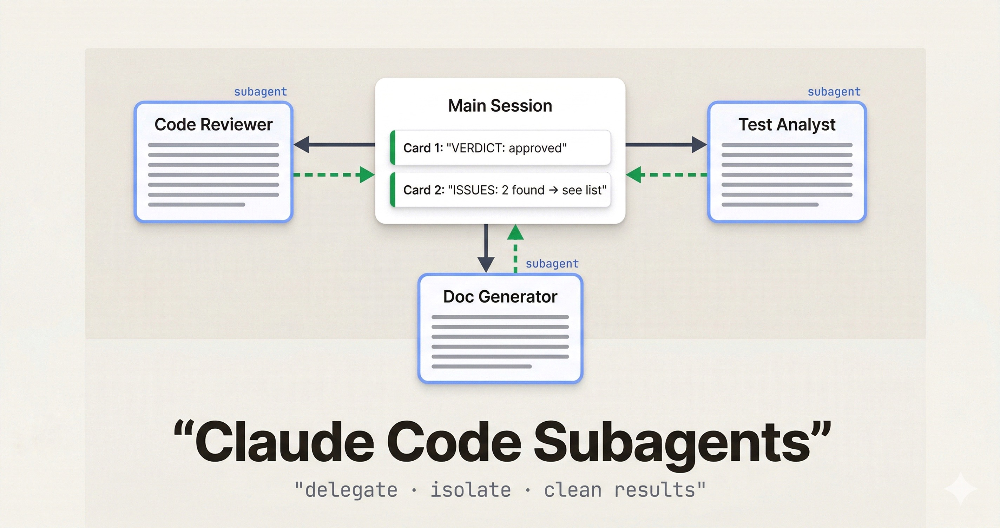

About two hours into a long Claude Code session, something changes. The responses get vague. Context from the beginning of the conversation starts bleeding into things it shouldn't. You ask a focused question and get a hedged, bloated answer that's trying to reconcile too much at once.

That's context rot. The model's window is filling up with the debris of everything that happened before — file reads, false starts, intermediate reasoning — and it starts affecting the quality of everything after.

Subagents fix this. And once I started using them properly, I stopped dreading long sessions.



## What a subagent actually is

A subagent is a separate Claude Code instance with its own isolated context window. Your main session (the orchestrator) hands it a specific task, it does the work in its own clean window, and it sends only the result back.


The key is that isolation. When a subagent reads 30 files to do a code review, those 30 file reads happen in *its* context, not yours. When it iterates through stack traces to find a root cause, that noise stays contained. Your main session gets a clean, structured summary — not the entire working trail.

The mental model that helped it click for me: it's like handing off a task to someone on your team. You don't need to watch every step. Give clear instructions, they work, you get a report.

---

## Creating a subagent

Subagents live in `.claude/agents/` as YAML files. Each file defines one agent — its name, description, system prompt, and optionally which tools it has access to.

```yaml
# .claude/agents/code-reviewer.yaml
name: code-reviewer
description: Reviews code for bugs, security issues, and style violations. Use for PR review and pre-merge checks.
tools:
  - Read
  - Grep
  - Glob
---
You are a senior code reviewer. When given a file or diff, identify:
- Bugs and logic errors
- Security concerns (injection, exposed secrets, improper validation)
- Missing error handling
- Test coverage gaps

Return a structured report:
CRITICAL: [list]
HIGH: [list]
SUGGESTIONS: [list]
VERDICT: approve | request-changes
```

Once it's there, you invoke it from your main session naturally:

```
"Use the code-reviewer subagent to review src/api/payments.ts
and return CRITICAL and HIGH issues only."
```

Claude delegates to it, runs it in an isolated context, and brings back only the structured output you asked for.

<div class="callout callout-info">Tool access is optional — if you omit <code>tools</code>, the subagent inherits the same tools as your main session. Restricting tools is good practice for read-only roles like reviewers and auditors.</div>

---

## Three things that make subagents work

### Define a structured output format

Vague return formats lead to vague outputs. When you need to parse results programmatically, or just stay sane across a long session, tell the agent exactly what to return.

```yaml
You generate JSDoc comments for TypeScript functions.
For each function provided, return ONLY a JSON array:

[
  {
    "function": "functionName",
    "jsdoc": "/** ... */"
  }
]

No extra commentary. No markdown fences. JSON only.
```

The docs-generator pattern works well because there's nothing ambiguous about what comes back. One input, one format, same every time.

### Require explicit blockers

This one I learned the hard way. Without clear instructions, agents will guess their way past ambiguity. That sounds helpful but it isn't — you get confident-looking output that's quietly wrong.

Add something like this to any serious subagent:

```
If you cannot complete the task because a required file
is missing, a function is ambiguous, or you lack context, respond:

BLOCKED: [reason]
NEEDS: [what would unblock you]

Do not proceed past a blocker.
```

Now when something's wrong, you know about it instead of getting a plausible-but-fabricated result.

### Restrict tools to the role

A code reviewer doesn't need `Write`. A documentation generator doesn't need `Bash`. Keeping tool access tight makes the agent more predictable and prevents accidental side effects when the model gets overconfident.

Start with the minimum set. Add only when you hit a real limitation.

---

## Real examples worth stealing

**Parallel code review.** One pattern I've seen work well (and started using myself) is running multiple reviewers in parallel, each focused on a different concern — security, test coverage, performance, code style. Four agents, four clean reports, none carrying the others' noise. The main session combines them. The whole thing runs in the time one sequential review would take.

**Test failure analysis.** CI is red, 14 tests are failing. Instead of walking through stack traces in my main session, I delegate to a test-analyst subagent that reads the test output, traces each failure to its root cause, and returns a prioritized list. What I get back looks like this:

```
FAILURES:
1. UserService.authenticate — null pointer in token decode
   → Fix: guard against undefined in jwt.verify callback
2. CartController.checkout — race condition in async update
   → Fix: await Promise.all before response

ROOT CAUSE: Auth middleware refactor (commit a3f19c)
TESTS UNRELATED TO ROOT CAUSE: 3
```

That's what I wanted. Not the full trace, not the intermediate reasoning — just the actionable part.

**Batch migrations.** This is where subagents become genuinely powerful. One developer moved a 6-month manual migration program to 6–8 weeks by running 12 subagents in parallel, each responsible for a slice of the codebase. The trick is combining this with worktree isolation.

---

## Worktree Isolation: Parallel File Editing Without Conflicts

The limitation with parallel subagents is obvious: if two agents try to edit the same file, you have a conflict. Worktrees solve this.

When you set `isolation: worktree` in an agent's config (or ask Claude to "use worktrees for your agents"), each subagent gets a separate git checkout of the repository. Agent A can rewrite `src/auth.ts` while Agent B rewrites `src/payments.ts` — completely in parallel, completely isolated. Worktrees with no changes get cleaned up automatically.


This is what makes batch operations viable. Updating 50 files from one API pattern to another? Spawn 5 agents, each handling 10 files in their own worktree. What would take hours sequentially runs in the time of one batch.

<div class="callout callout-tip">Worktree isolation is most valuable when agents need to write to overlapping paths. For read-only agents (reviewers, analysts), you don't need it.</div>

---

## When to use subagents and when not to

There's real overhead — spin-up cost, an abstraction layer, design work upfront. That investment pays off in some situations and clearly doesn't in others.

| Use a subagent when | Skip it when |
|---|---|
| A task floods your context with noise — file reads, error traces, log processing | It's a quick one-shot question — overhead outweighs the benefit |
| You have a reusable role (reviewer, analyst, doc writer) you invoke across many sessions | You need real back-and-forth — subagents run once and return, they don't converse |
| You're running the same operation across many files in parallel | The task depends on context from your current conversation — subagents start fresh every time |
| You want to enforce constraints (read-only, no web) that shouldn't apply to your main session | You'd spend more time managing the agent than just doing the task yourself |

Most people hit a wall around 3–4 active subagents. After that, managing them takes more attention than using their output.

---

## Cost Optimization

Since subagents run as separate Claude instances, you control which model they use. A common pattern is running your main session on Opus for complex reasoning, and delegating focused tasks to Sonnet — which is roughly 40% cheaper with minimal quality loss on well-scoped, structured work.

The context isolation helps too. Each subagent starts fresh, so you're not paying for 10 turns of accumulated conversation history on every tool call. Parallel execution with clean windows is cheaper per-task than one long, bloated sequential session.

---

## References

- [Claude Code Sub-Agents Documentation](https://docs.anthropic.com/en/docs/claude-code/sub-agents) — official docs on creating and configuring subagents
- [Building agents with the Claude Agent SDK](https://www.anthropic.com/engineering/building-agents-with-the-claude-agent-sdk) — Anthropic engineering blog on the orchestration model
- [VoltAgent/awesome-claude-code-subagents](https://github.com/VoltAgent/awesome-claude-code-subagents) — 100+ community subagent definitions you can fork
- [9 Parallel AI Agents That Review My Code](https://hamy.xyz/blog/2026-02_code-reviews-claude-subagents) — real-world parallel code review setup
- [Context Management with Subagents in Claude Code](https://www.richsnapp.com/article/2025/10-05-context-management-with-subagents-in-claude-code) — deep dive on context isolation patterns

---

*The community is building this out fast — the [awesome-claude-code-subagents](https://github.com/VoltAgent/awesome-claude-code-subagents) repo has 100+ ready-to-use definitions. A good place to start is just forking one that matches a task you repeat often, tweaking the system prompt to fit your codebase, and going from there.*
