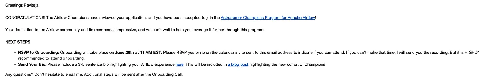
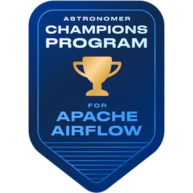
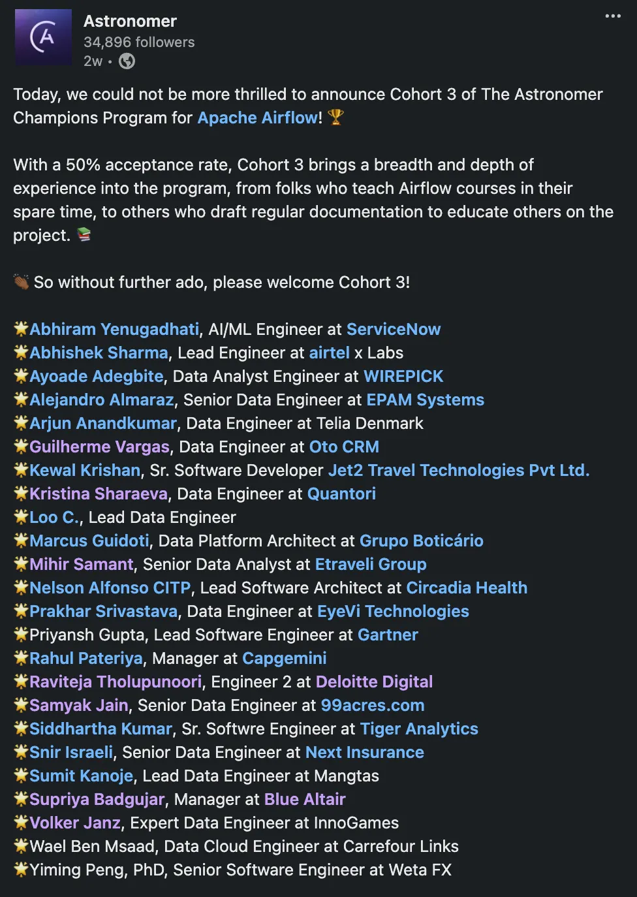
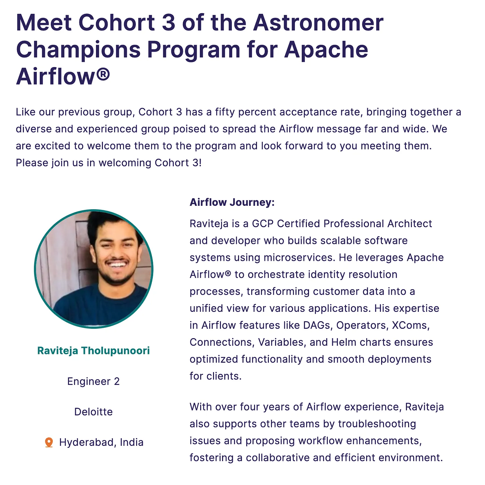
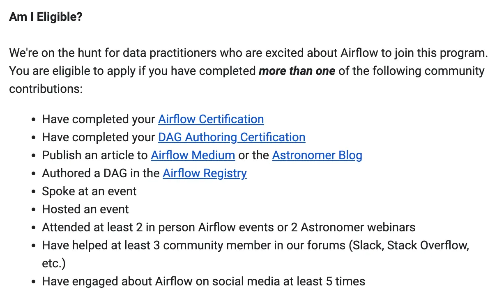
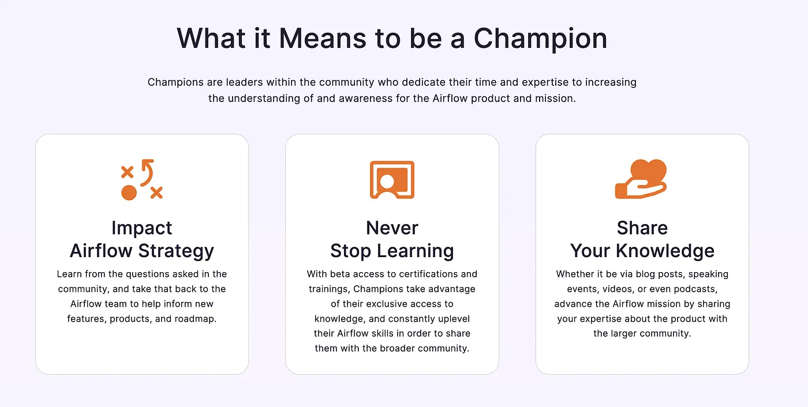
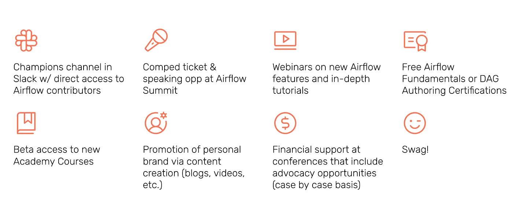

> Originally published on [Medium – Apache Airflow publication](https://medium.com/apache-airflow/handbook-for-becoming-an-apache-airflow-champion-de5b76b94acd).

## My Apache Airflow Journey

Back in 2019, I started working on a project to build a customer data platform (CDP) for a client. This involved processing massive amounts of data through various microservices. Initially, we used [Talend](https://www.talend.com/), an ETL tool, but managing it became cumbersome. Even minor changes to the pipeline or data schema required rebuilding and redeploying the entire Talend job.

This led me to explore alternatives, and that's when I came across [Apache Airflow](https://airflow.apache.org/). I dug into how it worked and became convinced that it was a better solution for our needs. I presented my findings to my team, and they agreed. That's how my journey with Airflow began!

Using Airflow I built cloud-agnostic solutions and deployed them in Azure Kubernetes Service (AKS) and Google Kubernetes Engine (GKE) — both Standard and AutoPilot clusters — and I'm currently working on AWS. This gave me excellent exposure to Airflow and to the infrastructure required for its different components.

## Airflow Fundamentals Certification

With all the knowledge I gained over 4–5 years, I was able to directly crack the **Airflow Fundamentals Certification**.

- **Learning Path:** [https://academy.astronomer.io/path/airflow-101](https://academy.astronomer.io/path/airflow-101)
- **Certificate:** [Credly Badge](https://www.credly.com/badges/cd274021-dae6-4d88-a954-142270d6b231/public_url)

## My Contribution to the Airflow Community

I started helping different teams within my organisation and on open source platforms with troubleshooting Airflow issues and proposing workflow enhancements, fostering a collaborative and efficient environment. This helped me gain more knowledge and solve different use cases.

## Airflow Champion's Journey

I came across [Astronomer's Champions for Apache Airflow](https://www.astronomer.io/champions/) while exploring my Credly certificate and applied to the program. All the work mentioned above helped me apply directly without any extra efforts.

After my application was reviewed by Astronomer's team, I was **selected as a Champion** in Cohort 3.

**Confirmation Mail**

**Certificate and Badge**

- **Certificate:** [Credly Badge](https://www.credly.com/badges/f31d1c0d-cb76-44a0-82fa-c24cfbd8e5aa/public_url)

**LinkedIn Post by Astronomer**

**Astronomer Champions Announcement**

- [Introducing Cohort 3 of the Astronomer Champions Program](https://www.astronomer.io/blog/introducing-cohort-3-astronomer-champions-program-apache-airflow/)

I was added to the official Airflow Slack channel, included in Airflow town halls, and received Airflow SWAG. Going forward I'll make full use of the other benefits offered through the program.

## How to Apply to the Astronomer Airflow Champions Program

Champions are community leaders who dedicate their time and expertise to enhancing the understanding and awareness of the Airflow product and mission.

**About the Program** — An initiative dedicated to fostering passionate advocates of Apache Airflow. The program is designed to empower and elevate the knowledge, influence, and leadership of committed members who champion the cause of Apache Airflow® technology.

- **Program page:** [https://www.astronomer.io/champions/](https://www.astronomer.io/champions/)
- **Application Link:** [Application Form](https://docs.google.com/forms/d/e/1FAIpQLScSKVzfRf3wppjUbzx0dUzFLwoP66ZfQ6rYLjk9ZASzpKA2Dw/viewform)

### Pre-requisites

Once your application is reviewed and selected for a cohort you'll receive a mail and you can start your Champion journey.

**What it means to be a Champion**

### Benefits

As a Champion member you'll enjoy exclusive benefits including complimentary certifications, access to Airflow contributors, beta access to new features, academy courses and certifications — and of course, swag 🎁

Feel free to reach out to me on [LinkedIn](https://www.linkedin.com/in/raviteja0096/) if you have any questions or want to learn more about the program!
