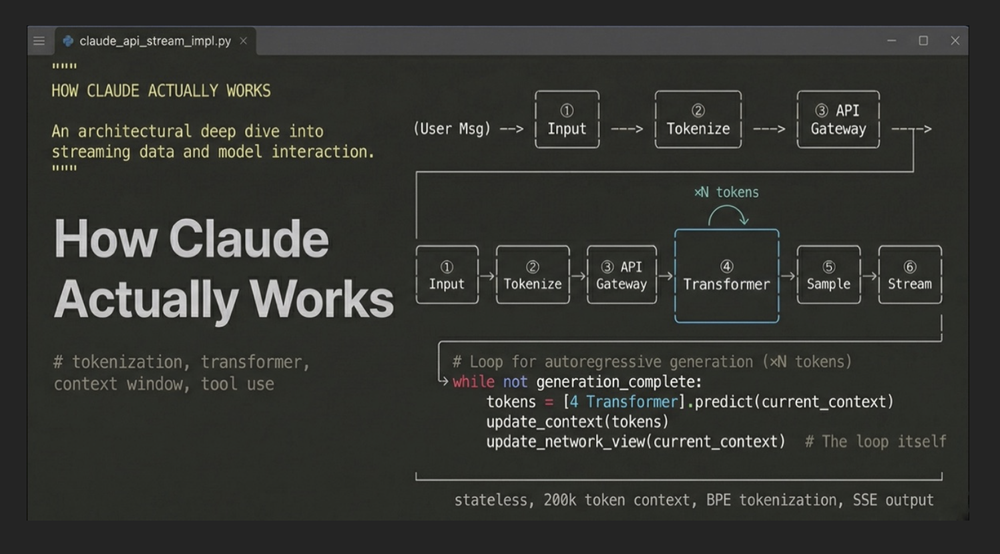

Most developers treat Claude like a black box. You send text, you get text back. That works — until it doesn't. Until you're debugging a cost spike, wondering why context from three turns ago got lost, or trying to understand why your tool-use agent keeps looping.


Once I understood what actually happens between "send" and "response," a lot of those mysteries went away. Here's the full picture.

## 1. The End-to-End Request Lifecycle

Seven things happen, in this order.


Seven things happen every time you send a message:

1. Your text (and optional images/files) gets packaged into a JSON payload
2. That payload hits `POST https://api.anthropic.com/v1/messages` over HTTPS
3. The API gateway validates your key, checks rate limits, and looks for cached prefixes
4. The full context — system prompt + conversation history + your message — is tokenized into integer IDs
5. Those IDs pass through Claude's transformer: attention layers, feed-forward networks, repeat
6. The model samples a token, appends it, repeats until `end_turn` or `max_tokens`
7. Each output token streams back to you as a Server-Sent Event the instant it's sampled

The whole thing is stateless. Claude holds nothing between requests. Every call is fresh.

## 2. Tokenization — Text Becomes Numbers

LLMs don't read text. They read integers. Tokenization is the translation layer.

Claude uses a variant of **Byte Pair Encoding (BPE)** — the same family as GPT, trained on Anthropic's own data. Common English words map to single tokens. Rare words, compound words, and code symbols get split into multiple subword pieces.

A rough mental model: **~4 characters per token, ~1.3 tokens per English word**. A 1,000-word post is roughly 1,300 tokens. Code runs denser — each `{`, `()`, or uncommon keyword becomes its own token.

Here's a concrete example. The sentence *"How does Apache Airflow schedule DAGs in production?"* breaks down like this:


Eleven tokens, eight words. And under the hood, those tokens are just integers like `[2437, 1838, 15308, 11460, ...]` — that's what enters the transformer.

**Why this matters for cost:** images add ~1,000–2,000 tokens regardless of visual complexity. Code is denser than prose. A 50-page PDF can be 40,000+ tokens. Token cost scales linearly with everything in the context window — which brings us to the next section.

## 3. API Request Anatomy

Every Claude interaction — whether from claude.ai, Claude Code, or your own app — becomes a single HTTPS `POST`:

```
POST https://api.anthropic.com/v1/messages
```

The minimal payload:

```json
{
  "model": "claude-sonnet-4-6",
  "max_tokens": 1024,
  "system": "You are a senior data engineer. Be concise and technical.",
  "messages": [
    { "role": "user", "content": "How does Airflow schedule a DAG?" }
  ],
  "stream": true,
  "temperature": 0.7
}
```

Required headers: `x-api-key`, `anthropic-version: 2023-06-01`, `content-type: application/json`.

The response includes a `usage` block that tells you exactly what you're paying for:

```json
"usage": {
  "input_tokens": 47,
  "output_tokens": 183
}
```

<div class="callout callout-warning">Output tokens cost ~5× more than input tokens on most Claude models. A 500-token response costs as much as 2,500 input tokens. Always set <code>max_tokens</code> explicitly — never leave it uncapped in production.</div>

## 4. Context Window — Claude's Working Memory

The context window is everything the model can "see" at once during inference. Claude supports up to **200,000 tokens** — roughly 150,000 words, around 500 pages of text.

What's actually inside that window on any given request:


Worth saying plainly: **Claude has no server-side memory**. No session object, no database lookup by conversation ID. The API is completely stateless.

The "memory" in a chat interface is an illusion created by the client. The app sends the full conversation history on every single request. This means a 10-turn conversation has 10× the input tokens of a 1-turn conversation — costs accumulate linearly.

## 5. How a Text Response is Generated

Once the token sequence enters the transformer, here's what happens — and crucially, why it repeats once per output token:


Each token ID maps to a high-dimensional vector — a 50-token input becomes a 50×4096 matrix. Then self-attention runs: every token looks at every other token and computes a weight. This is how *"it ran out of memory"* resolves "it" to "the server" three tokens back, not "the query" from twenty back. Claude does this through hundreds of layers.

After attention, each token passes through a feed-forward network. This is where the model's "knowledge" lives — not in a database, but encoded as learned weights.

The final layer scores every token in the vocabulary (roughly 100,000 entries). Softmax turns those scores into probabilities. `temperature` controls the sharpness: 0 is nearly deterministic, 1 is creative. `top_p` trims the long tail. One token gets sampled, gets appended to the sequence, and the whole thing runs again.

One forward pass per token. That's why longer responses are slower and more expensive. There's no shortcut.

## 6. Streaming — Why Tokens Appear Word by Word

Streaming uses **Server-Sent Events (SSE)** — the server keeps the HTTP connection open and fires an event the instant each token is sampled. You're not waiting for the whole response to finish before seeing the first word.

The raw event stream looks like:

```
event: content_block_delta
data: {"type":"content_block_delta","delta":{"text":"Air"}}

event: content_block_delta
data: {"type":"content_block_delta","delta":{"text":"flow"}}

event: message_delta
data: {"usage":{"output_tokens":183},"stop_reason":"end_turn"}
```

Consuming it in Python:

```python
import anthropic

client = anthropic.Anthropic()

with client.messages.stream(
    model="claude-sonnet-4-6",
    max_tokens=1024,
    messages=[{"role": "user", "content": "Explain Airflow sensors"}]
) as stream:
    for text in stream.text_stream():
        print(text, end="", flush=True)  # prints token by token
```

The `usage` metadata (final token counts) only arrives on the last event — not per token. Plan accordingly if you're doing real-time cost tracking.

## 7. Multi-Turn Conversations — You Are the State Manager

This one catches almost everyone the first time. There is no session. There is no conversation ID you can pass to retrieve prior context. Every request is a blank slate.

Your conversation history is just an array you manage yourself. Each turn, you send the full thing:


```python
conversation_history = []

def chat(user_message):
    conversation_history.append({"role": "user", "content": user_message})

    response = client.messages.create(
        model="claude-sonnet-4-6",
        max_tokens=1024,
        messages=conversation_history  # full history every time
    )

    assistant_reply = response.content[0].text
    conversation_history.append({"role": "assistant", "content": assistant_reply})

    return assistant_reply
```

This scales fine for short conversations. For long ones — say, a coding session that's gone 30 turns deep — you'll hit the context limit and your input costs grow with every turn. Apps like claude.ai handle this by summarizing older messages or dropping them once they fall outside the window.

## 8. Prompt Caching — The Hidden Cost Optimizer

Prompt caching is the one I see developers skip most. If you have a large, stable prefix — a long system prompt, a document you're analyzing, your entire codebase — **prompt caching** stores its KV-cache server-side and reuses it across requests.

The economics:


- **Cache write**: ~25% premium over standard input tokens (first request computes and stores it)
- **Cache read**: ~90% cheaper than standard input tokens
- **Cache TTL**: 5 minutes by default, 1 hour if you pin it

You opt in with a single field on the content block:

```json
{
  "system": [
    {
      "type": "text",
      "text": "[Your 5,000-token architecture doc here...]",
      "cache_control": {"type": "ephemeral"}
    }
  ]
}
```

The response's `usage` block tells you what hit the cache:

```json
"usage": {
  "input_tokens": 12,
  "cache_creation_input_tokens": 5000,  // written this request
  "cache_read_input_tokens": 0          // 5000 on next request
}
```

<div class="callout callout-tip">I work on data pipelines at Deloitte where Claude sessions routinely load large DBT project files and pipeline configs. With prompt caching, after the first request those docs cost 90% less to re-include. On a long session that adds up fast.</div>

Minimum cacheable prefix is ~1,024 tokens on Sonnet — small prompts aren't worth caching.

## 9. Tool Use — How Claude Actually "Does Things"

Claude can't execute code or call APIs. What it *can* do is emit structured JSON describing a function call. Your code runs it and returns the result. This is the building block behind every AI agent.


The five-step loop:

1. You define tools as JSON Schema objects in the request payload
2. Claude returns a `tool_use` content block instead of text — `stop_reason: "tool_use"`
3. You parse the call, run your actual function (DB query, API call, whatever)
4. You append the tool call + your result as a `tool_result` message
5. You make a new API request — Claude now answers with real data

```python
tools = [{
    "name": "get_dag_status",
    "description": "Returns the last run status of an Airflow DAG",
    "input_schema": {
        "type": "object",
        "properties": {
            "dag_id": {"type": "string", "description": "The DAG identifier"}
        },
        "required": ["dag_id"]
    }
}]

# First call — Claude returns a tool_use block, not text
response = client.messages.create(
    model="claude-sonnet-4-6",
    max_tokens=1024,
    tools=tools,
    messages=[{"role": "user", "content": "Did my etl_pipeline DAG run today?"}]
)
# response.stop_reason == "tool_use"
# response.content[0] == {"type": "tool_use", "name": "get_dag_status",
#                          "input": {"dag_id": "etl_pipeline"}}

# Your code executes the actual function
dag_status = get_dag_status("etl_pipeline")  # "SUCCESS — ran 6h ago"

# Second call — include the tool result
response2 = client.messages.create(
    model="claude-sonnet-4-6",
    max_tokens=1024,
    tools=tools,
    messages=[
        {"role": "user", "content": "Did my etl_pipeline DAG run today?"},
        {"role": "assistant", "content": response.content},
        {
            "role": "user",
            "content": [{
                "type": "tool_result",
                "tool_use_id": response.content[0].id,
                "content": str(dag_status)
            }]
        }
    ]
)
# Claude now returns: "Yes, etl_pipeline ran successfully 6 hours ago."
```

<div class="callout callout-info">This is literally how Claude Code works. When you ask it to edit a file, it calls <code>read_file</code>, then <code>write_file</code> — both tool calls running in this exact loop. You're seeing the final text responses after each tool roundtrip completes.</div>

## 10. Putting It All Together

Every Claude interaction — text, image, code, agent — flows through the same pipeline:

1. **Input assembly** — system + history + message + optional images → JSON payload
2. **Tokenization** — BPE encodes everything into integer token IDs
3. **Inference** — transformer runs attention across all tokens, samples next token, repeats
4. **Streaming output** — tokens fire back via SSE, usage metadata arrives at end

Once you see it as a stateless inference function — not a chatbot — the design decisions make sense. Stateless means infinitely scalable. The context window is RAM, not a database. Prompt caching is how you avoid paying to re-read the same documents on every request. Tool use is how you connect that stateless function to the rest of your stack.

That's the full picture. Everything else is details.
